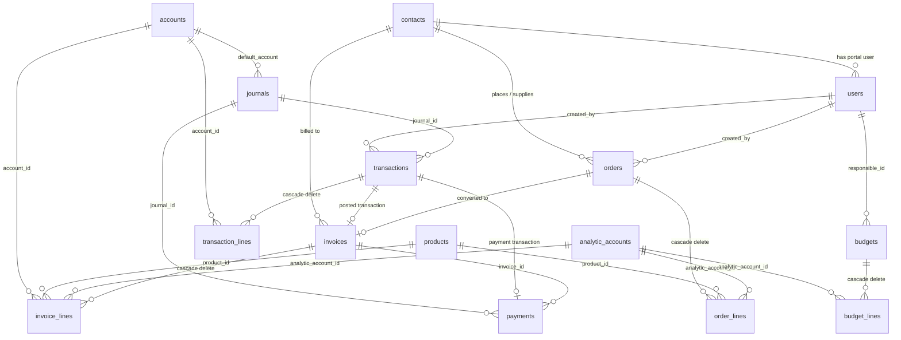

# AccountanT++ : Full API Routes & Database Schema Reference

This reference documents **every backend route**, its exact request/response contract, connecting variables, and the **complete 16-table database schema**.

---

## 1. Global Conventions & Architecture

### Base URL & Server Structure
- **Dev Server**: `http://localhost:3000`
- **Root Health Check**:
  - `GET /` &rarr; `"AccountanT++ API is running"`
  - `GET /health` &rarr; `{"status":"ok","db":"connected"}`
- **API Router Prefix**: All application endpoints are mounted under `/api`.
  *(Note for frontend integration: If your React frontend was expecting `/api/v1/...`, make sure to use `/api/...` or configure your Vite proxy accordingly).*

### Authentication & Authorization
- **Mechanism**: HTTP Header `Authorization: Bearer <JWT_TOKEN>`
- **JWT Payload**:
  ```json
  {
    "sub": 1,              // Integer user ID (users.id)
    "role": "admin",       // "admin" | "accountant" | "contact"
    "contactId": null,     // Integer contacts.id (only present if role === "contact")
    "exp": 1788650000
  }
  ```
- **Roles**:
  1. `admin`: Full access to everything (master data archive/delete, user management, posting, reporting).
  2. `accountant`: Operations access (create/update master data, create/confirm/convert orders, create/post invoices & bills, record payments, view reports). Cannot delete master data or manage users.
  3. `contact`: Portal user (Customer or Vendor). Isolated exclusively to `/api/portal/*`. Can only view and pay their own invoices/bills (`invoices.contact_id === req.user.contactId`).

### Standard System Accounts & Seed Data
Pre-seeded via `backend/db/seed.js`:
| Account Code | Account Name | Type | Normal Balance | Purpose |
|---|---|---|---|---|
| `1000` | Cash | `Asset` | Debit | Cash in hand, default account for Cash Journal |
| `1010` | Bank | `Asset` | Debit | Bank account, default account for Bank Journal |
| `1100` | Debtors | `Asset` | Debit | Accounts Receivable (Customer Invoices Dr) |
| `2000` | Creditors | `Liability` | Credit | Accounts Payable (Vendor Bills Cr) |
| `2100` | Tax Payable | `Liability` | Credit | Sales tax collected (Cr) / Purchase tax paid (Dr) |
| `3000` | Owner's Capital | `Capital` | Credit | Equity / Initial Capital |
| `4000` | Sale Income | `Income` | Credit | Default Revenue account for customer sales |
| `5000` | Purchase Expense | `Expense` | Debit | Default Expense account for vendor purchases |

### Default Journals
| Journal Name | Type | Linked Account Code | Account Name |
|---|---|---|---|
| `Sales Journal` | `sale` | `4000` | Sale Income |
| `Purchase Journal` | `purchase` | `5000` | Purchase Expense |
| `Bank Journal` | `bank` | `1010` | Bank |
| `Cash Journal` | `cash` | `1000` | Cash |

---

## 2. Exhaustive API Route Catalog

### Module 1: Authentication (`/api/auth`)

#### 1.1 Self-Register
- **`POST /api/auth/register`**
- **Auth**: Public (no token)
- **Request Body**:
  ```json
  {
    "username": "gaurav",       // string, required
    "email": "gaurav@test.com", // string, required, unique
    "password": "password123"   // string, required, min 6 chars
  }
  ```
- **Logic**: First registered user in database automatically gets `role: "admin"`. All subsequent self-registrations receive `role: "accountant"`.
- **Response (201 Created)**:
  ```json
  {
    "user": {
      "id": 1,
      "username": "gaurav",
      "email": "gaurav@test.com",
      "role": "admin",
      "contactId": null,
      "createdAt": "2026-09-05T10:00:00.000Z"
    }
  }
  ```

#### 1.2 Login (Unified for Admin, Accountant, and Contact)
- **`POST /api/auth/login`**
- **Auth**: Public (no token)
- **Request Body**:
  ```json
  {
    "email": "admin@accountant.local", // string, required
    "password": "admin123"             // string, required
  }
  ```
- **Response (200 OK)**:
  ```json
  {
    "token": "eyJhbGciOiJIUzI1NiIsInR5cCI6IkpXVCJ9...",
    "user": {
      "id": 1,
      "username": "admin",
      "email": "admin@accountant.local",
      "role": "admin", // "admin" | "accountant" | "contact"
      "contactId": null,
      "createdAt": "2026-09-05T10:00:00.000Z"
    }
  }
  ```

#### 1.3 Current User Info
- **`GET /api/auth/me`**
- **Auth**: `authRequired` (Bearer token)
- **Response (200 OK)**: User object `{ id, username, email, role, contactId, createdAt }`

#### 1.4 List All Users
- **`GET /api/auth/users`**
- **Auth**: `admin` only
- **Response (200 OK)**: Array of User objects `[ { id, username, email, role, contactId, createdAt }, ... ]`

#### 1.5 Create User (Admin Provisioning)
- **`POST /api/auth/users`**
- **Auth**: `admin` only
- **Request Body**:
  ```json
  {
    "username": "portal_customer",
    "email": "customer@urban.com",
    "password": "password123",
    "role": "contact", // "admin" | "accountant" | "contact" (default: "accountant")
    "contactId": 4     // required IF role === "contact", references contacts.id
  }
  ```
- **Response (201 Created)**: User object

---

### Module 2: Contacts Master (`/api/contacts`)

#### 2.1 List Contacts
- **`GET /api/contacts`**
- **Auth**: `authRequired`
- **Query Params**:
  - `type`: optional, `"customer"` | `"vendor"` | `"both"`
  - `archived`: optional, `"true"` | `"false"` (default: `"false"` hides archived contacts)
- **Response (200 OK)**:
  ```json
  [
    {
      "id": 1,
      "name": "Urban Wood Supplies",
      "type": "vendor", // "customer" | "vendor" | "both"
      "email": "sales@woodsupplies.in",
      "mobile": "+919876543210",
      "city": "Mumbai",
      "state": "Maharashtra",
      "pincode": "400001",
      "profileImage": "https://...",
      "isArchived": false,
      "createdAt": "2026-09-05T10:00:00.000Z"
    }
  ]
  ```

#### 2.2 Create Contact
- **`POST /api/contacts`**
- **Auth**: `admin` or `accountant`
- **Request Body**:
  ```json
  {
    "name": "Acme Corp",       // string, required
    "type": "customer",        // "customer" | "vendor" | "both", required
    "email": "contact@acme.com",
    "mobile": "9998887776",
    "city": "Bengaluru",
    "state": "Karnataka",
    "pincode": "560001",
    "profileImage": null
  }
  ```
- **Response (201 Created)**: Created Contact object

#### 2.3 Get Contact by ID
- **`GET /api/contacts/:id`**
- **Auth**: `authRequired`
- **Path Param**: `id` (integer)
- **Response (200 OK)**: Contact object

#### 2.4 Update Contact
- **`PUT /api/contacts/:id`**
- **Auth**: `admin` or `accountant`
- **Path Param**: `id` (integer)
- **Request Body**: Any editable fields `{ name, type, email, mobile, city, state, pincode, profileImage }`
- **Response (200 OK)**: Updated Contact object

#### 2.5 Toggle Archive Contact
- **`PATCH /api/contacts/:id/archive`**
- **Auth**: `admin` only
- **Response (200 OK)**: Updated Contact object with inverted `isArchived` boolean.

#### 2.6 Delete Contact
- **`DELETE /api/contacts/:id`**
- **Auth**: `admin` only
- **Nuance**: Returns `409 Conflict` if contact has any associated invoices or bills. Must archive instead.
- **Response (204 No Content)**

---

### Module 3: Chart of Accounts (`/api/accounts`)

#### 3.1 List Accounts
- **`GET /api/accounts`**
- **Auth**: `authRequired`
- **Query Params**:
  - `type`: optional, `"Asset"` | `"Liability"` | `"Income"` | `"Expense"` | `"Capital"`
  - `archived`: optional, `"true"` | `"false"` (default: `"false"`)
- **Response (200 OK)**:
  ```json
  [
    {
      "id": 1,
      "accountCode": "1000",
      "accountName": "Cash",
      "type": "Asset",
      "balance": 15000.00, // serialized as JavaScript Number
      "isArchived": false
    }
  ]
  ```

#### 3.2 Create Account
- **`POST /api/accounts`**
- **Auth**: `admin` or `accountant`
- **Request Body**:
  ```json
  {
    "accountCode": "1020",      // string, required, unique
    "accountName": "Petty Cash", // string, required
    "type": "Asset"             // "Asset" | "Liability" | "Income" | "Expense" | "Capital"
  }
  ```
- **Response (201 Created)**: Created Account object

#### 3.3 Get Account by ID
- **`GET /api/accounts/:id`**
- **Response (200 OK)**: Account object with `balance: number`

#### 3.4 Update Account
- **`PUT /api/accounts/:id`**
- **Auth**: `admin` or `accountant`
- **Request Body**: `{ "accountName": "Updated Name", "type": "Asset" }`
- **Nuance**: If the account already has transaction lines or invoice lines, its `type` is **locked** and cannot be changed (returns `409 Conflict`).
- **Response (200 OK)**: Updated Account object

#### 3.5 Archive Account
- **`PATCH /api/accounts/:id/archive`**
- **Auth**: `admin` only
- **Response (200 OK)**: Toggled `isArchived` Account object

#### 3.6 Delete Account
- **`DELETE /api/accounts/:id`**
- **Auth**: `admin` only
- **Nuance**: Returns `409 Conflict` if the account has ledger activity.
- **Response (204 No Content)**

---

### Module 4: Products Master (`/api/products`)

#### 4.1 List Products
- **`GET /api/products`**
- **Auth**: `authRequired`
- **Query Params**:
  - `type`: optional, `"goods"` | `"service"` | `"combo"`
  - `archived`: optional, `"true"` | `"false"`
- **Response (200 OK)**:
  ```json
  [
    {
      "id": 1,
      "name": "Oak Dining Table",
      "type": "goods", // "goods" | "service" | "combo"
      "salesPrice": 12000.00,
      "purchaseCost": 8000.00,
      "category": "Furniture",
      "quantityOnHand": 25.00,
      "isArchived": false
    }
  ]
  ```

#### 4.2 Create Product
- **`POST /api/products`**
- **Auth**: `admin` or `accountant`
- **Request Body**:
  ```json
  {
    "name": "Ergonomic Office Chair", // string, required
    "type": "goods",                 // "goods" | "service" | "combo", required
    "salesPrice": 4500.00,           // number
    "purchaseCost": 2800.00,         // number
    "category": "Chairs"             // string
  }
  ```
- **Response (201 Created)**: Serialized Product object

#### 4.3 Get Product by ID
- **`GET /api/products/:id`**
- **Response (200 OK)**: Product object

#### 4.4 Update Product
- **`PUT /api/products/:id`**
- **Request Body**: `{ name, type, salesPrice, purchaseCost, category }`
- **Response (200 OK)**: Updated Product object

#### 4.5 Archive Product
- **`PATCH /api/products/:id/archive`**
- **Auth**: `admin` only
- **Response (200 OK)**: Toggled Product object

#### 4.6 Delete Product
- **`DELETE /api/products/:id`**
- **Auth**: `admin` only
- **Nuance**: Fails with `409 Conflict` if used on any existing `order_lines`.
- **Response (204 No Content)**

---

### Module 5: Journals (`/api/journals`)

#### 5.1 List Journals
- **`GET /api/journals`**
- **Auth**: `authRequired`
- **Response (200 OK)**:
  ```json
  [
    {
      "id": 1,
      "name": "Sales Journal",
      "type": "sale", // "sale" | "purchase" | "bank" | "cash"
      "defaultAccountId": 7,
      "defaultAccountName": "Sale Income",
      "defaultAccountCode": "4000"
    }
  ]
  ```

#### 5.2 Create Journal
- **`POST /api/journals`**
- **Auth**: `admin` or `accountant`
- **Request Body**:
  ```json
  {
    "name": "Secondary Bank Journal",
    "type": "bank", // "sale" | "purchase" | "bank" | "cash"
    "defaultAccountId": 2 // ID of an existing account
  }
  ```
- **Response (201 Created)**: Journal object

---

### Module 6: Analytic Accounts (`/api/analytic-accounts`)
Used for departmental/project cost centers & budget variance tracking.

#### 6.1 List Analytic Accounts
- **`GET /api/analytic-accounts`**
- **Response (200 OK)**: `[ { "id": 1, "name": "Marketing & Advertising", "type": "expense" } ]`

#### 6.2 Create Analytic Account
- **`POST /api/analytic-accounts`**
- **Auth**: `admin` or `accountant`
- **Request Body**: `{ "name": "Showroom Renovation", "type": "expense" }` // type: "income" | "expense"
- **Response (201 Created)**: Analytic Account object

#### 6.3 Update Analytic Account
- **`PUT /api/analytic-accounts/:id`**
- **Request Body**: `{ "name": "...", "type": "..." }`
- **Response (200 OK)**

#### 6.4 Delete Analytic Account
- **`DELETE /api/analytic-accounts/:id`**
- **Auth**: `admin` only
- **Response (204 No Content)**

---

### Module 7: Budgets (`/api/budgets`)

#### 7.1 List Budgets
- **`GET /api/budgets`**
- **Response (200 OK)**:
  ```json
  [
    {
      "id": 1,
      "name": "Q1 2026 Operations",
      "startDate": "2026-01-01",
      "endDate": "2026-03-31",
      "responsibleId": 1,
      "responsibleName": "admin"
    }
  ]
  ```

#### 7.2 Create Budget
- **`POST /api/budgets`**
- **Auth**: `admin` or `accountant`
- **Request Body**:
  ```json
  {
    "name": "Q1 2026 Operations",
    "startDate": "2026-01-01",
    "endDate": "2026-03-31",
    "responsibleId": 1,
    "lines": [
      {
        "analyticAccountId": 1,
        "plannedAmount": 150000.00
      }
    ]
  }
  ```
- **Response (201 Created)**: Created Budget header

#### 7.3 Get Budget Details
- **`GET /api/budgets/:id`**
- **Response (200 OK)**:
  ```json
  {
    "id": 1,
    "name": "Q1 2026 Operations",
    "startDate": "2026-01-01",
    "endDate": "2026-03-31",
    "responsibleId": 1,
    "responsibleName": "admin",
    "lines": [
      {
        "id": 1,
        "analyticAccountId": 1,
        "analyticName": "Marketing",
        "analyticType": "expense",
        "plannedAmount": 150000
      }
    ]
  }
  ```

#### 7.4 Budget Variance Report
- **`GET /api/budgets/:id/report`**
- **Logic**: Automatically sums actual line totals from all **POSTED** documents dated within `[startDate, endDate]` tagged with each analytic account.
- **Response (200 OK)**:
  ```json
  {
    "budget": {
      "id": 1,
      "name": "Q1 2026 Operations",
      "startDate": "2026-01-01",
      "endDate": "2026-03-31"
    },
    "lines": [
      {
        "analyticAccountId": 1,
        "analyticName": "Marketing",
        "analyticType": "expense",
        "planned": 150000.00,
        "actual": 112000.00,
        "variance": 38000.00,      // for expense: planned - actual (positive is good)
        "achievementPct": 74.67
      }
    ],
    "totals": {
      "planned": 150000.00,
      "actual": 112000.00
    }
  }
  ```

---

### Module 8: Orders (Purchase & Sale Intent) (`/api/orders`)

*Important Concept: Orders are commercial intents. They never touch the ledger, never create journal entries, and never mutate inventory.*

#### 8.1 List Orders
- **`GET /api/orders`**
- **Query Params**: `kind`: optional, `"purchase"` | `"sale"`
- **Response (200 OK)**:
  ```json
  [
    {
      "id": 1,
      "kind": "sale", // "purchase" | "sale"
      "contactId": 3,
      "contactName": "ABC Interior Decorators",
      "date": "2026-09-05",
      "status": "draft", // "draft" | "confirmed" | "converted"
      "totalAmount": 28320.00,
      "createdBy": 1
    }
  ]
  ```

#### 8.2 Create Order
- **`POST /api/orders`**
- **Auth**: `admin` or `accountant`
- **Request Body**:
  ```json
  {
    "kind": "sale",       // "purchase" | "sale", required
    "contactId": 3,       // integer, required (must match contact type)
    "date": "2026-09-05", // "YYYY-MM-DD", required
    "lines": [
      {
        "productId": 1,               // optional (can be null for ad-hoc items)
        "analyticAccountId": 2,       // optional
        "description": "Dining Table", // optional, defaults to product name
        "quantity": 2,                // positive number, default 1.00
        "unitPrice": 12000.00,        // optional if productId provided
        "taxRate": 18                 // percentage (e.g. 18 for 18%), default 0.00
      }
    ]
  }
  ```
- **Response (201 Created)**: Order header

#### 8.3 Get Order by ID
- **`GET /api/orders/:id`**
- **Response (200 OK)**:
  ```json
  {
    "id": 1,
    "kind": "sale",
    "contactId": 3,
    "contactName": "ABC Interior Decorators",
    "date": "2026-09-05",
    "status": "draft",
    "totalAmount": 28320.00,
    "createdBy": 1,
    "lines": [
      {
        "id": 1,
        "productId": 1,
        "productName": "Oak Dining Table",
        "analyticAccountId": 2,
        "description": "Dining Table",
        "quantity": 2,
        "unitPrice": 12000,
        "taxRate": 18,
        "lineTotal": 24000
      }
    ],
    "document": null // if converted, holds { "id": 10, "status": "draft" }
  }
  ```

#### 8.4 Confirm Order
- **`POST /api/orders/:id/confirm`**
- **Auth**: `admin` or `accountant`
- **Logic**: Transitions status from `"draft"` &rarr; `"confirmed"`.
- **Response (200 OK)**: Updated Order header

#### 8.5 Convert Order to Document (Invoice/Bill)
- **`POST /api/orders/:id/convert`**
- **Auth**: `admin` or `accountant`
- **Request Body**:
  ```json
  {
    "dueDate": "2026-09-25" // optional, defaults to order date
  }
  ```
- **Logic**:
  1. Verifies order is in `"confirmed"` status.
  2. Creates a new **DRAFT** row in `invoices` with `kind: "invoice"` (if sale) or `kind: "bill"` (if purchase).
  3. Copies all order lines into `invoice_lines`.
  4. Marks order status as `"converted"`.
  5. *Ledger is STILL untouched* (accounting posting happens when document is posted).
- **Response (201 Created)**: Created draft Invoice/Bill object

---

### Module 9: Invoices & Vendor Bills (`/api/invoices`)

*Handles both Customer Invoices (`kind: "invoice"`) and Vendor Bills (`kind: "bill"`).*

#### 9.1 List Documents
- **`GET /api/invoices`**
- **Query Params**:
  - `kind`: optional, `"invoice"` | `"bill"`
  - `status`: optional, `"draft"` | `"posted"` | `"partial"` | `"paid"`
- **Response (200 OK)**:
  ```json
  [
    {
      "id": 1,
      "kind": "invoice",
      "orderId": 1,
      "contactId": 3,
      "contactName": "ABC Interior Decorators",
      "transactionId": 12, // null if draft
      "date": "2026-09-05",
      "dueDate": "2026-09-25",
      "subtotal": 24000.00,
      "taxAmount": 4320.00,
      "totalAmount": 28320.00,
      "status": "posted", // "draft" | "posted" | "partial" | "paid"
      "paid": 10000.00,
      "balanceDue": 18320.00
    }
  ]
  ```

#### 9.2 Create Direct Draft Invoice / Bill (Without Order)
- **`POST /api/invoices`**
- **Auth**: `admin` or `accountant`
- **Request Body**:
  ```json
  {
    "kind": "invoice",       // "invoice" (customer) | "bill" (vendor)
    "contactId": 3,
    "date": "2026-09-05",
    "dueDate": "2026-09-25",
    "lines": [
      {
        "productId": 1,
        "accountId": 7, // optional: defaults to 4000 Sale Income (invoice) or 5000 Purchase Expense (bill)
        "analyticAccountId": 2, // optional
        "description": "Direct Sale",
        "quantity": 1,
        "unitPrice": 12000.00,
        "taxRate": 18
      }
    ]
  }
  ```
- **Response (201 Created)**: Created draft Invoice/Bill object

#### 9.3 Get Document Details
- **`GET /api/invoices/:id`**
- **Response (200 OK)**:
  ```json
  {
    "id": 1,
    "kind": "invoice",
    "orderId": 1,
    "contactId": 3,
    "contactName": "ABC Interior Decorators",
    "transactionId": 12,
    "date": "2026-09-05",
    "dueDate": "2026-09-25",
    "subtotal": 24000,
    "taxAmount": 4320,
    "totalAmount": 28320,
    "status": "posted",
    "lines": [
      {
        "id": 1,
        "productId": 1,
        "productName": "Oak Dining Table",
        "accountId": 7,
        "accountCode": "4000",
        "accountName": "Sale Income",
        "analyticAccountId": 2,
        "description": "Dining Table",
        "quantity": 2,
        "unitPrice": 12000,
        "taxRate": 18,
        "lineSubtotal": 24000,
        "lineTax": 4320
      }
    ],
    "payments": [
      {
        "id": 1,
        "invoiceId": 1,
        "transactionId": 13,
        "journalId": 3,
        "date": "2026-09-05",
        "amount": 10000,
        "method": "bank"
      }
    ],
    "paid": 10000,
    "balanceDue": 18320
  }
  ```

#### 9.4 Post Document to Ledger
- **`POST /api/invoices/:id/post`**
- **Auth**: `admin` or `accountant`
- **Crucial Core Logic**:
  - Validates document is in `"draft"` status.
  - Generates balanced double-entry in `transactions` & `transaction_lines`:
    - **Customer Invoice**:
      - `Dr Debtors (1100)`: `totalAmount`
      - `Cr Sale Income (4000)`: `subtotal`
      - `Cr Tax Payable (2100)`: `taxAmount` (if tax > 0)
      - Atomically **decrements** inventory stock (`products.quantityOnHand`) for goods.
    - **Vendor Bill**:
      - `Dr Purchase Expense (5000)`: `subtotal`
      - `Dr Tax Payable (2100)`: `taxAmount` (if tax > 0)
      - `Cr Creditors (2000)`: `totalAmount`
      - Atomically **increments** inventory stock (`products.quantityOnHand`) for goods.
  - Updates `invoices.status` &rarr; `"posted"` and sets `invoices.transaction_id`.
- **Response (200 OK)**: `{ "invoice": { ... }, "transaction": { ... } }`

#### 9.5 List Payments of an Invoice
- **`GET /api/invoices/:id/payments`**
- **Response (200 OK)**: Array of payment records for this invoice

#### 9.6 Record Payment against Invoice / Bill
- **`POST /api/invoices/:id/payments`**
- **Auth**: `admin` or `accountant`
- **Request Body**:
  ```json
  {
    "amount": 18320.00,    // positive number, cannot exceed balanceDue
    "method": "bank",       // "bank" | "cash", required
    "date": "2026-09-05"    // "YYYY-MM-DD", optional (defaults to today)
  }
  ```
- **Ledger Posting**:
  - **Invoice Payment**:
    - `Dr Bank (1010)` or `Cash (1000)`: `amount`
    - `Cr Debtors (1100)`: `amount`
  - **Bill Payment**:
    - `Dr Creditors (2000)`: `amount`
    - `Cr Bank (1010)` or `Cash (1000)`: `amount`
- **Status Update**: If `totalPaid >= totalAmount`, invoice `status` &rarr; `"paid"`; otherwise `"partial"`.
- **Response (201 Created)**:
  ```json
  {
    "id": 2,
    "invoiceId": 1,
    "transactionId": 14,
    "journalId": 3,
    "date": "2026-09-05",
    "amount": 18320,
    "method": "bank",
    "documentStatus": "paid",
    "balanceDue": 0
  }
  ```

---

### Module 10: Payments Hub (`/api/payments`)

#### 10.1 List All Payments across System
- **`GET /api/payments`**
- **Auth**: `authRequired`
- **Response (200 OK)**:
  ```json
  [
    {
      "id": 1,
      "invoiceId": 1,
      "invoiceKind": "invoice",
      "transactionId": 14,
      "journalId": 3,
      "journalName": "Bank Journal",
      "date": "2026-09-05",
      "amount": 18320,
      "method": "bank",
      "contactId": 3,
      "contactName": "ABC Interior Decorators"
    }
  ]
  ```

---

### Module 11: General Ledger & Manual Transactions (`/api/transactions`)

#### 11.1 List Journal Entries
- **`GET /api/transactions`**
- **Auth**: `authRequired`
- **Response (200 OK)**:
  ```json
  [
    {
      "id": 1,
      "journalId": 3,
      "journalName": "Bank Journal",
      "journalType": "bank",
      "date": "2026-09-05",
      "description": "Payment received for invoice #1",
      "reference": "PAY-1",
      "createdBy": 1,
      "createdByUsername": "admin",
      "total": 18320
    }
  ]
  ```

#### 11.2 Post Manual Journal Entry
- **`POST /api/transactions`**
- **Auth**: `admin` or `accountant`
- **Request Body**:
  ```json
  {
    "journalId": 4,             // integer, Cash Journal
    "date": "2026-09-05",       // "YYYY-MM-DD"
    "description": "Owner Capital Addition",
    "reference": "CAP-001",
    "lines": [
      { "accountId": 1, "debit": 50000, "credit": 0 },  // Dr Cash
      { "accountId": 6, "debit": 0, "credit": 50000 }   // Cr Owner's Capital
    ]
  }
  ```
- **Validation Rules**:
  - At least 2 lines.
  - Each line has either `debit > 0` or `credit > 0`, never both or neither.
  - `SUM(debit) === SUM(credit)`.
  - Atomically updates cached `accounts.balance` based on account normal balance.
- **Response (201 Created)**: Transaction object with lines

#### 11.3 Get Journal Entry by ID
- **`GET /api/transactions/:id`**
- **Response (200 OK)**:
  ```json
  {
    "id": 1,
    "journalId": 4,
    "journalName": "Cash Journal",
    "journalType": "cash",
    "date": "2026-09-05",
    "description": "Owner Capital Addition",
    "reference": "CAP-001",
    "createdBy": 1,
    "createdByUsername": "admin",
    "lines": [
      {
        "id": 1,
        "accountId": 1,
        "accountCode": "1000",
        "accountName": "Cash",
        "debit": 50000,
        "credit": 0
      },
      {
        "id": 2,
        "accountId": 6,
        "accountCode": "3000",
        "accountName": "Owner's Capital",
        "debit": 0,
        "credit": 50000
      }
    ]
  }
  ```

---

### Module 12: Financial Reports & Analytics (`/api/reports`)

*Reports recompute dynamically from `transaction_lines` (the immutable ledger). The `accounts.balance` column is only a fast cache.*

#### 12.1 Trial Balance
- **`GET /api/reports/trial-balance`**
- **Query Params**: `?from=YYYY-MM-DD&to=YYYY-MM-DD`
- **Response (200 OK)**:
  ```json
  {
    "from": "2026-01-01",
    "to": "2026-12-31",
    "rows": [
      {
        "id": 1,
        "accountCode": "1000",
        "accountName": "Cash",
        "type": "Asset",
        "debit": 50000,
        "credit": 0,
        "balance": 50000
      }
    ],
    "totals": {
      "debit": 50000,
      "credit": 50000,
      "balanced": true
    }
  }
  ```

#### 12.2 Profit & Loss (P&L) Statement
- **`GET /api/reports/profit-loss`**
- **Query Params**: `?from=YYYY-MM-DD&to=YYYY-MM-DD`
- **Response (200 OK)**:
  ```json
  {
    "from": "2026-01-01",
    "to": "2026-12-31",
    "income": {
      "accounts": [
        { "id": 7, "accountCode": "4000", "accountName": "Sale Income", "amount": 24000 }
      ],
      "total": 24000
    },
    "expenses": {
      "accounts": [
        { "id": 8, "accountCode": "5000", "accountName": "Purchase Expense", "amount": 8000 }
      ],
      "total": 8000
    },
    "netProfit": 16000
  }
  ```

#### 12.3 Balance Sheet
- **`GET /api/reports/balance-sheet`**
- **Query Params**: `?asof=YYYY-MM-DD`
- **Response (200 OK)**:
  ```json
  {
    "asof": "2026-09-05",
    "assets": {
      "accounts": [ ... ],
      "total": 66000
    },
    "liabilities": {
      "accounts": [ ... ],
      "total": 4320
    },
    "capital": {
      "accounts": [ ... ],
      "total": 50000,
      "netProfit": 11680,
      "totalWithEarnings": 61680
    },
    "check": {
      "equation": "Assets = Liabilities + Capital (incl. net profit)",
      "holds": true
    }
  }
  ```

#### 12.4 General Ledger by Account
- **`GET /api/reports/ledger/:accountId`**
- **Path Param**: `accountId` (integer)
- **Query Params**: `?from=YYYY-MM-DD&to=YYYY-MM-DD`
- **Response (200 OK)**:
  ```json
  {
    "account": { "id": 1, "accountCode": "1000", "accountName": "Cash", "type": "Asset", "balance": 50000 },
    "entries": [
      {
        "lineId": 1,
        "transactionId": 1,
        "journalName": "Cash Journal",
        "date": "2026-09-05",
        "description": "Owner Capital Addition",
        "reference": "CAP-001",
        "debit": 50000,
        "credit": 0,
        "runningBalance": 50000
      }
    ],
    "closingBalance": 50000
  }
  ```

#### 12.5 Financial Dashboard Summary
- **`GET /api/reports/dashboard`**
- **Auth**: `authRequired`
- **Response (200 OK)**:
  ```json
  {
    "income": 24000,
    "expenses": 8000,
    "netProfit": 16000,
    "cashBalance": 15000,
    "bankBalance": 45000,
    "debtorsBalance": 18320,
    "creditorsBalance": 0,
    "outstanding": {
      "receivable": 18320,
      "payable": 0
    },
    "documents": {
      "byStatus": {
        "invoice:posted": 1,
        "bill:paid": 1
      }
    },
    "recentTransactions": [
      {
        "id": 14,
        "date": "2026-09-05",
        "description": "Payment received for invoice #1",
        "reference": "PAY-1",
        "journalName": "Bank Journal"
      }
    ]
  }
  ```

---

### Module 13: Customer & Vendor Portal (`/api/portal`)

*Protected exclusively for users where `role === "contact"`. Scoped automatically to `req.user.contactId`.*

#### 13.1 List Contact's Own Documents
- **`GET /api/portal/documents`**
- **Query Params**: `kind`: optional, `"invoice"` (for customer) | `"bill"` (for vendor)
- **Response (200 OK)**:
  ```json
  [
    {
      "id": 1,
      "kind": "invoice",
      "date": "2026-09-05",
      "dueDate": "2026-09-25",
      "totalAmount": 28320,
      "status": "posted",
      "paid": 10000,
      "balanceDue": 18320
    }
  ]
  ```

#### 13.2 Get Contact's Own Document by ID
- **`GET /api/portal/documents/:id`**
- **Response (200 OK)**: Complete invoice details with payment history

#### 13.3 Pay Contact's Own Document
- **`POST /api/portal/documents/:id/pay`**
- **Request Body**:
  ```json
  {
    "amount": 18320.00,
    "method": "bank" // "bank" | "cash" (defaults to "bank")
  }
  ```
- **Response (201 Created)**: Payment confirmation object

---

## 3. Complete Database Schema (All 16 Tables)



---

### Detailed Table Specifications

#### Table 1: `contacts`
*Customer, Vendor, or Dual-role entity master data.*
- `id`: `serial PRIMARY KEY`
- `name`: `varchar(255) NOT NULL`
- `type`: `varchar(20) NOT NULL` &rarr; Enum: `'customer'`, `'vendor'`, `'both'`
- `email`: `varchar(255)`
- `mobile`: `varchar(30)`
- `city`: `varchar(100)`
- `state`: `varchar(100)`
- `pincode`: `varchar(20)`
- `profile_image`: `varchar(500)`
- `is_archived`: `boolean NOT NULL DEFAULT false`
- `created_at`: `timestamp with time zone NOT NULL DEFAULT now()`

#### Table 2: `users`
*System users for back-office and customer/vendor portal.*
- `id`: `serial PRIMARY KEY`
- `username`: `varchar(255) NOT NULL`
- `email`: `varchar(255) NOT NULL UNIQUE`
- `password_hash`: `varchar(255) NOT NULL` (bcrypt 10 rounds)
- `role`: `varchar(20) NOT NULL DEFAULT 'accountant'` &rarr; Enum: `'admin'`, `'accountant'`, `'contact'`
- `contact_id`: `integer REFERENCES contacts(id)` (NULL for admin/accountant, required for contact portal users)
- `created_at`: `timestamp with time zone NOT NULL DEFAULT now()`

#### Table 3: `products`
*Item catalog for sale or purchase.*
- `id`: `serial PRIMARY KEY`
- `name`: `varchar(255) NOT NULL`
- `type`: `varchar(20) NOT NULL` &rarr; Enum: `'goods'`, `'service'`, `'combo'`
- `sales_price`: `numeric(15, 2) NOT NULL DEFAULT '0.00'`
- `purchase_cost`: `numeric(15, 2) NOT NULL DEFAULT '0.00'`
- `category`: `varchar(100)`
- `quantity_on_hand`: `numeric(15, 2) NOT NULL DEFAULT '0.00'` (Stock balance)
- `is_archived`: `boolean NOT NULL DEFAULT false`

#### Table 4: `accounts`
*Chart of Accounts (CoA).*
- `id`: `serial PRIMARY KEY`
- `account_code`: `varchar(50) NOT NULL UNIQUE` (e.g. "1000", "1100")
- `account_name`: `varchar(255) NOT NULL`
- `type`: `varchar(20) NOT NULL` &rarr; Enum: `'Asset'`, `'Liability'`, `'Income'`, `'Expense'`, `'Capital'`
- `balance`: `numeric(15, 2) NOT NULL DEFAULT '0.00'` (Materialized cache; ledger is source of truth)
- `is_archived`: `boolean NOT NULL DEFAULT false`

#### Table 5: `journals`
*Accounting transaction categories.*
- `id`: `serial PRIMARY KEY`
- `name`: `varchar(255) NOT NULL`
- `type`: `varchar(20) NOT NULL` &rarr; Enum: `'sale'`, `'purchase'`, `'bank'`, `'cash'`
- `default_account_id`: `integer NOT NULL REFERENCES accounts(id)`

#### Table 6: `analytic_accounts`
*Cost centers and departmental tags for budgets and reporting.*
- `id`: `serial PRIMARY KEY`
- `name`: `varchar(255) NOT NULL`
- `type`: `varchar(20) NOT NULL` &rarr; Enum: `'income'`, `'expense'`

#### Table 7: `transactions`
*Double-entry journal entry headers.*
- `id`: `serial PRIMARY KEY`
- `journal_id`: `integer NOT NULL REFERENCES journals(id)`
- `date`: `date NOT NULL`
- `description`: `text`
- `reference`: `varchar(255)` (e.g. "INV-1", "BILL-2", "PAY-1")
- `created_by`: `integer NOT NULL REFERENCES users(id)`

#### Table 8: `transaction_lines`
*Double-entry debit and credit lines.*
- `id`: `serial PRIMARY KEY`
- `transaction_id`: `integer NOT NULL REFERENCES transactions(id) ON DELETE CASCADE`
- `account_id`: `integer NOT NULL REFERENCES accounts(id)`
- `debit`: `numeric(15, 2) NOT NULL DEFAULT '0.00'`
- `credit`: `numeric(15, 2) NOT NULL DEFAULT '0.00'`

#### Table 9: `orders`
*Purchase Orders and Sales Orders (commercial intents).*
- `id`: `serial PRIMARY KEY`
- `kind`: `varchar(10) NOT NULL` &rarr; Enum: `'purchase'`, `'sale'`
- `contact_id`: `integer NOT NULL REFERENCES contacts(id)`
- `date`: `date NOT NULL`
- `status`: `varchar(20) NOT NULL DEFAULT 'draft'` &rarr; Enum: `'draft'`, `'confirmed'`, `'converted'`
- `total_amount`: `numeric(15, 2) NOT NULL DEFAULT '0.00'`
- `created_by`: `integer NOT NULL REFERENCES users(id)`
- `created_at`: `timestamp with time zone NOT NULL DEFAULT now()`

#### Table 10: `order_lines`
*Line items of an order.*
- `id`: `serial PRIMARY KEY`
- `order_id`: `integer NOT NULL REFERENCES orders(id) ON DELETE CASCADE`
- `product_id`: `integer REFERENCES products(id)`
- `analytic_account_id`: `integer REFERENCES analytic_accounts(id)`
- `description`: `text`
- `quantity`: `numeric(15, 2) NOT NULL DEFAULT '1.00'`
- `unit_price`: `numeric(15, 2) NOT NULL`
- `tax_rate`: `numeric(5, 2) NOT NULL DEFAULT '0.00'`

#### Table 11: `invoices`
*Customer Invoices and Vendor Bills.*
- `id`: `serial PRIMARY KEY`
- `kind`: `varchar(10) NOT NULL` &rarr; Enum: `'invoice'` (Customer), `'bill'` (Vendor)
- `order_id`: `integer REFERENCES orders(id)` (NULL if direct invoice)
- `contact_id`: `integer NOT NULL REFERENCES contacts(id)`
- `transaction_id`: `integer REFERENCES transactions(id)` (NULL while in 'draft' status)
- `date`: `date NOT NULL`
- `due_date`: `date NOT NULL`
- `subtotal`: `numeric(15, 2) NOT NULL DEFAULT '0.00'`
- `tax_amount`: `numeric(15, 2) NOT NULL DEFAULT '0.00'`
- `total_amount`: `numeric(15, 2) NOT NULL`
- `status`: `varchar(20) NOT NULL DEFAULT 'draft'` &rarr; Enum: `'draft'`, `'posted'`, `'partial'`, `'paid'`

#### Table 12: `invoice_lines`
*Line items of an invoice or bill.*
- `id`: `serial PRIMARY KEY`
- `invoice_id`: `integer NOT NULL REFERENCES invoices(id) ON DELETE CASCADE`
- `product_id`: `integer REFERENCES products(id)`
- `account_id`: `integer NOT NULL REFERENCES accounts(id)` (Defaults to 4000 for invoice, 5000 for bill)
- `analytic_account_id`: `integer REFERENCES analytic_accounts(id)` (Links to budget actuals)
- `description`: `text`
- `quantity`: `numeric(15, 2) NOT NULL DEFAULT '1.00'`
- `unit_price`: `numeric(15, 2) NOT NULL`
- `tax_rate`: `numeric(5, 2) NOT NULL DEFAULT '0.00'`

#### Table 13: `payments`
*Payments made or received against invoices/bills.*
- `id`: `serial PRIMARY KEY`
- `invoice_id`: `integer NOT NULL REFERENCES invoices(id)`
- `transaction_id`: `integer NOT NULL REFERENCES transactions(id)`
- `journal_id`: `integer NOT NULL REFERENCES journals(id)` (Cash or Bank journal)
- `date`: `date NOT NULL`
- `amount`: `numeric(15, 2) NOT NULL`
- `method`: `varchar(20) NOT NULL` &rarr; Enum: `'cash'`, `'bank'`

#### Table 14: `budgets`
*Budget headers for financial planning periods.*
- `id`: `serial PRIMARY KEY`
- `name`: `varchar(255) NOT NULL`
- `start_date`: `date NOT NULL`
- `end_date`: `date NOT NULL`
- `responsible_id`: `integer NOT NULL REFERENCES users(id)`
- `created_at`: `timestamp with time zone NOT NULL DEFAULT now()`

#### Table 15: `budget_lines`
*Target amounts per analytic account.*
- `id`: `serial PRIMARY KEY`
- `budget_id`: `integer NOT NULL REFERENCES budgets(id) ON DELETE CASCADE`
- `analytic_account_id`: `integer NOT NULL REFERENCES analytic_accounts(id)`
- `planned_amount`: `numeric(15, 2) NOT NULL`

#### Table 16: `__drizzle_migrations`
*Drizzle ORM internal migration tracker table.*
- `id`: `serial PRIMARY KEY`
- `hash`: `text NOT NULL`
- `created_at`: `bigint`

---

## 4. Frontend Integration & Variable Mapping Cheat Sheet

When wiring React components from another laptop, look out for these exact mappings:

| Frontend UI Component | Expected Backend URL | Required Payload / Params | Key Connected Variables |
|---|---|---|---|
| **Admin Login Form** | `POST /api/auth/login` | `{ email, password }` | Stores `token` in `localStorage` or context; checks `user.role === 'admin'` |
| **Accountant Login Form** | `POST /api/auth/login` | `{ email, password }` | Stores `token`; checks `user.role === 'accountant'` |
| **Customer / Vendor Login Form** | `POST /api/auth/login` | `{ email, password }` | Stores `token`; checks `user.role === 'contact'`, receives `user.contactId` |
| **Customer Portal Invoices** | `GET /api/portal/documents?kind=invoice` | `Authorization: Bearer <token>` | Display `id`, `date`, `dueDate`, `totalAmount`, `paid`, `balanceDue`, `status` |
| **Customer Invoice Pay** | `POST /api/portal/documents/:id/pay` | `{ amount, method }` | `amount <= balanceDue`; triggers instant Dr Bank / Cr AR entry |
| **Vendor Portal Bills** | `GET /api/portal/documents?kind=bill` | `Authorization: Bearer <token>` | Shows bills issued by the vendor and payment status |
| **Orders List / Create** | `GET / POST /api/orders` | `{ kind: "sale"|"purchase", contactId, date, lines: [{ productId, quantity, unitPrice, taxRate }] }` | Note field is `kind`, NOT `orderType` or `type` |
| **Convert Order** | `POST /api/orders/:id/convert` | `{ dueDate }` | Moves order from `confirmed` to `converted`, returns newly generated draft invoice |
| **Invoices List** | `GET /api/invoices?kind=invoice` | None | Returns customer invoices with calculated `paid` and `balanceDue` |
| **Bills List** | `GET /api/invoices?kind=bill` | None | Returns vendor bills with calculated `paid` and `balanceDue` |
| **Post Invoice / Bill** | `POST /api/invoices/:id/post` | None | Creates the transaction and decrements/increments stock |
| **Record Payment (Office)** | `POST /api/invoices/:id/payments` | `{ amount, method: "cash"|"bank", date }` | Posts cash/bank transaction, changes status to `partial` or `paid` |
| **Trial Balance** | `GET /api/reports/trial-balance` | `?from=...&to=...` | Returns `{ rows, totals: { debit, credit, balanced } }` |
| **P&L Statement** | `GET /api/reports/profit-loss` | `?from=...&to=...` | Returns `{ income: { accounts, total }, expenses: { accounts, total }, netProfit }` |
| **Balance Sheet** | `GET /api/reports/balance-sheet` | `?asof=...` | Returns `{ assets, liabilities, capital: { accounts, total, netProfit, totalWithEarnings }, check: { equation, holds } }` |
| **Budget Report** | `GET /api/budgets/:id/report` | None | Returns planned vs actuals with variance and achievement percentage |
| **Admin Dashboard** | `GET /api/reports/dashboard` | None | Returns quick stats (`income`, `expenses`, `netProfit`, `outstanding`, `cashBalance`, `bankBalance`, `debtorsBalance`, `creditorsBalance`) |

### Common Name Mismatches to Check in React Code
1. **API Prefix**: Change `/api/v1/...` &rarr; `/api/...`.
2. **Login URLs**: Change `/api/v1/auth/admin/login` or `/api/v1/auth/consumer/login` &rarr; single endpoint `POST /api/auth/login`.
3. **Contact Roles & Types**:
   - `contact.type` in DB is `'customer' | 'vendor' | 'both'`
   - `user.role` in DB is `'admin' | 'accountant' | 'contact'`
4. **Numeric Values**: Numbers are returned as pure JavaScript numbers (e.g. `24000`, `18320.5`), not strings (`"24000.00"`).
5. **Enums & Lowercase**:
   - Order kinds: `"purchase"`, `"sale"`
   - Invoice kinds: `"invoice"`, `"bill"`
   - Payment methods: `"cash"`, `"bank"`
   - Journal types: `"sale"`, `"purchase"`, `"bank"`, `"cash"`
   - Analytic types: `"income"`, `"expense"`
